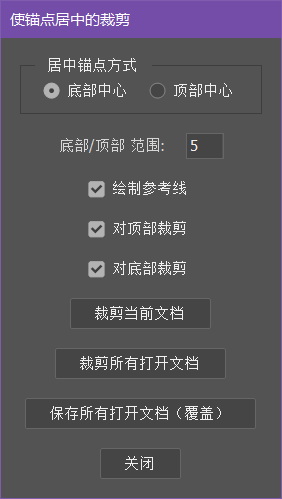

# CenterAvatarSpriteAnchorForGameEngine

一个 Photoshop（PS） 脚本，可以将角色图片裁剪从而保持锚点居中，用于游戏引擎（Unity/UE）中导入成统一锚点的 sprite 使用

下载链接：[Download .jsx File](https://github.com/CCCCCO2/PhotoShopCenterAvatarSpriteAnchorforGameEngine/releases/download/v1.0/CenterAvatarSpriteAnchorForGameEngine.jsx)

由于是在游戏引擎中使用的 sprite，所以图片拥有并且要求有以下特点：

- .png 格式
- 图像模式为“RGB颜色”
- （可选）对批量保存的要求是一个文档只有一个合并后的图层，否则请手动保存

# PS脚本界面

# 使用说明
### 打开脚本
在 PS 中，“文件” -> “脚本” -> “浏览...”，选择该 JavaScript 脚本打开窗口

### 功能说明

- 裁剪当前文档：对当前文档的活跃图层进行裁剪从而保持锚点居中
- 裁剪所有打开文档：对所有打开文档的活跃图层进行裁剪从而保持锚点居中
- 保存所有打开文档（覆盖）：以覆盖保存的方式保存所有打开文档（建议配合“裁剪所有打开文档”使用）

### 参数说明

- 居中锚点方式：指裁剪后图片锚点的居中方式，包括“底部中心”和“顶部中心”，“底部中心”为锚点保持在角色脚部中心，“顶部中心”为锚点保持在角色头顶中心
- 底部/顶部 范围：锚点会保持在角色的顶部/底部中心，该值是指要识别的角色头部（顶部）/脚部（底部）的距图片上/下边界的纵向范围
- 绘制参考线：是否绘制辅助参考线
- 对顶部裁剪：是否裁剪图片顶部的空白部分
- 对底部裁剪：是否裁剪图片底部的空白部分

### 使用示例参考

现在有一批需要处理为锚点居中在底部的图像

打开 PS ，将所有图片打开，并打开脚本窗口

对可选参数进行设置，此时由于默认参数已经满足该需求所以不进行变动，点击“裁剪所有打开文档”

裁剪后，再点击“保存所有裁剪打开文档（覆盖）”，处理完毕，现在所有图片的锚点都位于角色的底部中心

